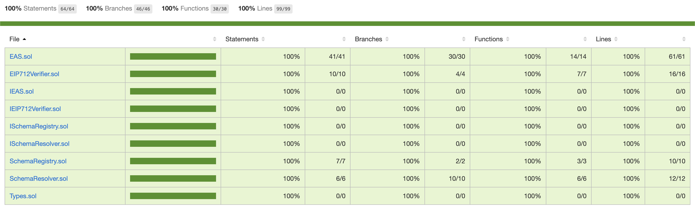

# Ethereum Attestation Service

[](https://eas.eth.link)
[](https://www.npmjs.org/package/@ethereum-attestation-service/contracts)
[](https://github.com/ethereum-attestation-service/contracts/actions/workflows/workflow.yml)
[](https://github.com/ethereum-attestation-service/eas-contracts/blob/master/LICENSE)

## Introduction

The Ethereum Attestation Service is a free and open protocol for on-chain attestations on EVM compatible blockchains. It is a generalized service that allows anyone to register a schema for their particular use case, and then make attestations following their schema.

Schemas can be registered using the `ASRegistry.sol` contract, and attestations are made using the `EAS.sol` contract.

In addition, we provide a resolver contract for advanced use cases, such as on-chain verification of attestation data, and also attaching payments to attestations (which makes a new suite of powerful web3 applications possible).

We also provide an SDK for developers.

On-chain attestations will enable a powerful new range of web3 applications, including:

* Identity
* Trust Scores
* Goodness Scores
* Credit Scores
* Clout
* Land Registries
* Social Networks
* Portable Trust Layers
* Retroactive Public Goods Funding
* KYC Services
* Uncollateralized Lending / Borrowing
* Voting
* Oracles (who can be atomically paid for making attestations inside the protocol)
* Likes/Dislikes
* Content Filtering
* And many more!

## Deployments

### Goerli

#### v0.10

* **EAS**: <https://goerli.etherscan.io/address/TBD>
* **ASRegistry**: <https://rinkeby.etherscan.io/address/TBD>
* **EIP712Verifier**: <https://rinkeby.etherscan.io/address/TBD>

## Installation

```sh
yarn install @ethereum-attestation-service/contracts
```

## Testing

Testing the protocol is possible via multiple approaches:

### Unit Tests

You can run the full test suite via:

```sh
yarn test
```

### Deployment Tests

You can test new deployments (and the health of the network) against a mainnet fork via:

```sh
yarn test:deploy
```

Please make sure to properly configure your Tenderly settings via `.env`.

This will automatically be skipped on an already deployed and configured deployment scripts and will only test the additional changeset resulting by running any new/pending deployment scripts and perform an e2e test against the up to date state. This is especially useful to verify that any future deployments and upgrades, suggested by the DAO, work correctly and preserve the integrity of the system.

### Test Coverage

#### Latest Test Coverage Report (2022-09-30)

* 100% Statements 55/55
* 100% Branches 34/34
* 100% Functions 25/25
* 100% Lines 87/87



```sh
----------------------|----------|----------|----------|----------|----------------|
File                  |  % Stmts | % Branch |  % Funcs |  % Lines |Uncovered Lines |
----------------------|----------|----------|----------|----------|----------------|
 contracts/           |      100 |      100 |      100 |      100 |                |
  ASRegistry.sol      |      100 |      100 |      100 |      100 |                |
  ASResolver.sol      |      100 |      100 |      100 |      100 |                |
  EAS.sol             |      100 |      100 |      100 |      100 |                |
  EIP712Verifier.sol  |      100 |      100 |      100 |      100 |                |
  IASRegistry.sol     |      100 |      100 |      100 |      100 |                |
  IASResolver.sol     |      100 |      100 |      100 |      100 |                |
  IEAS.sol            |      100 |      100 |      100 |      100 |                |
  IEIP712Verifier.sol |      100 |      100 |      100 |      100 |                |
  Types.sol           |      100 |      100 |      100 |      100 |                |
----------------------|----------|----------|----------|----------|----------------|
All files             |      100 |      100 |      100 |      100 |                |
----------------------|----------|----------|----------|----------|----------------|
```

#### Instructions

In order to audit the test coverage of the full test suite, run:

```sh
yarn test:coverage
```

## Profiling

You can profile the gas costs of all of the user-focused flows (provisioning or removing liquidity, trading, participating in auto-compounding staking rewards, migrating v2.1 positions, taking a flash-loan, etc.) via:

```sh
yarn test:profile
```

## Deploying

The contracts have built-in support for deployments on different chains and mainnet forks. You can deploy the project by:

```sh
yarn deploy
```

There’s also a special deployment mode which deploys the protocol to a mainnet fork, with additional goodies. It can be run via:

```sh
yarn deploy:fork
```

The framework was inspired and adopted from [Bancor V3](https://github.com/bancorprotocol/contracts-v3).

## License

EAS is open source and distributed under the MIT License (see [`LICENSE`](./LICENSE)).
